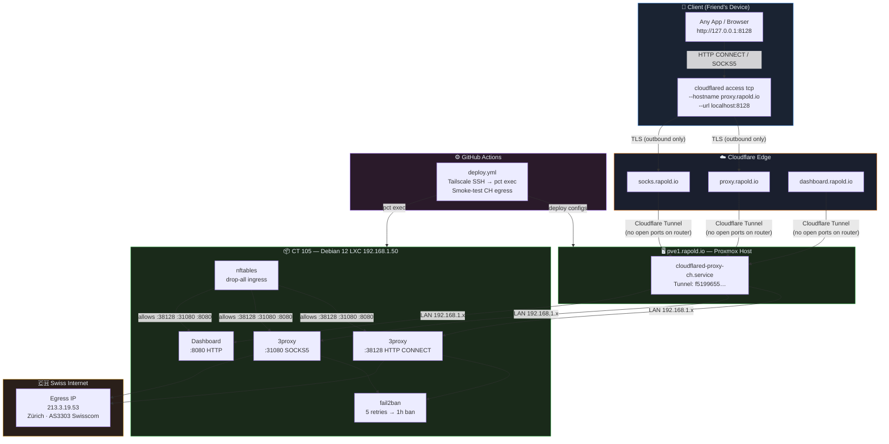

# proxy-ch

A self-hosted forward proxy with a **Swiss (CH) egress IP**, running on a Proxmox LXC container and exposed securely via Cloudflare Tunnel — no port-forwarding required.

| | |
|---|---|
| **Egress IP** | `213.3.19.53` · Zürich · CH · AS3303 Swisscom |
| **Protocols** | HTTP CONNECT · SOCKS5 |
| **Auth** | Username / Password (strong auth) |
| **Access** | Cloudflare Tunnel (zero-trust TCP) |
| **Proxy software** | [3proxy](https://github.com/3proxy/3proxy) |

---

## Table of Contents

- [Architecture](#architecture)
- [Prerequisites](#prerequisites)
- [Infrastructure Setup](#infrastructure-setup)
  - [1. Proxmox LXC Container](#1-proxmox-lxc-container)
  - [2. Install 3proxy](#2-install-3proxy)
  - [3. Configure 3proxy](#3-configure-3proxy)
  - [4. Firewall (nftables)](#4-firewall-nftables)
  - [5. Fail2ban](#5-fail2ban)
  - [6. Cloudflare Tunnel](#6-cloudflare-tunnel)
  - [7. DNS](#7-dns)
- [Deployment (GitHub Actions)](#deployment-github-actions)
- [Client Setup](#client-setup)
  - [HTTP Proxy](#http-proxy)
  - [SOCKS5](#socks5)
  - [Browser (FoxyProxy)](#browser-foxyproxy)
  - [Autostart](#autostart)
- [Maintenance](#maintenance)
- [Security](#security)

---

## Architecture



**Key design decisions:**

| Decision | Reason |
|----------|--------|
| Cloudflare Tunnel instead of port-forwarding | No router changes needed; traffic encrypted end-to-end |
| Dedicated LXC container | Isolation; proxy can't touch host or other VMs |
| Local-managed tunnel (not Dashboard) | Config lives in git; reproducible deploys |
| 3proxy | Lightweight (~200 KB binary), HTTP + SOCKS5, native `auth strong` |
| nftables drop-all | Proxy ports reachable only from LAN; Cloudflare Tunnel connects from inside |
| fail2ban | Blocks brute-force on credentials |

---

## Prerequisites

| Component | Where |
|-----------|-------|
| Proxmox VE host | `pve1.rapold.io` (Tailscale reachable) |
| Cloudflare account | Zone `rapold.io` managed by Cloudflare |
| Tailscale | SSH access to Proxmox host |
| GitHub repo secrets | See [Deployment](#deployment-github-actions) |

---

## Infrastructure Setup

### 1. Proxmox LXC Container

Create an **unprivileged** Debian 12 container via the Proxmox UI or CLI:

```bash
# On pve-1 host
pct create 105 local:vztmpl/debian-12-standard_12.7-1_amd64.tar.zst \
  --hostname proxy-ch \
  --memory 512 \
  --cores 1 \
  --net0 name=eth0,bridge=vmbr0,ip=192.168.1.50/24,gw=192.168.1.1 \
  --unprivileged 1 \
  --start 1
```

> **Static IP:** `192.168.1.50/24` — must not conflict with existing DHCP leases.

### 2. Install 3proxy

```bash
# Inside CT 105
apt-get update && apt-get install -y build-essential git

git clone https://github.com/3proxy/3proxy.git /tmp/3proxy-src
cd /tmp/3proxy-src
make -f Makefile.Linux
make -f Makefile.Linux install

mkdir -p /usr/local/3proxy/{conf,logs,pid}
useradd -r -s /usr/sbin/nologin 3proxy
chown -R 3proxy:3proxy /usr/local/3proxy
```

**systemd service** (`/etc/systemd/system/3proxy.service`):

```ini
[Unit]
Description=3proxy forward proxy
After=network.target

[Service]
Type=simple
User=3proxy
ExecStart=/usr/local/3proxy/bin/3proxy /usr/local/3proxy/conf/3proxy.cfg
Restart=on-failure
RestartSec=5

[Install]
WantedBy=multi-user.target
```

```bash
systemctl daemon-reload
systemctl enable --now 3proxy
```

### 3. Configure 3proxy

**`/usr/local/3proxy/conf/3proxy.cfg`**

```
nscache 65536
nserver 1.1.1.1
nserver 1.0.0.1
config /conf/3proxy.cfg
monitor /conf/3proxy.cfg
log /logs/3proxy-%y%m%d.log D
logformat "L%y-%m-%d %H:%M:%S %N.%p %E %U %C:%c %R:%r %O %I %h %T"
rotate 14
users $/conf/passwd
auth strong
allow *
proxy -p38128 -a -n
socks -p31080 -a
```

**Password file** (`/usr/local/3proxy/conf/passwd`):

Passwords are stored as **CL (clear-text)** — 3proxy hashes them internally at auth time. Use a strong random password.

```
USERNAME:CL:PASSWORD
```

Generate a secure password:

```bash
openssl rand -base64 21
```

Write the file and secure it:

```bash
echo "chproxy:CL:$(openssl rand -base64 21)" > /usr/local/3proxy/conf/passwd
chmod 600 /usr/local/3proxy/conf/passwd
chown 3proxy:3proxy /usr/local/3proxy/conf/passwd
```

Reload:

```bash
systemctl reload 3proxy   # or kill -HUP $(pidof 3proxy)
```

### 4. Firewall (nftables)

**`/etc/nftables.conf`** — drop-all input policy; only allow established connections, LAN SSH, and proxy ports:

```nft
#!/usr/sbin/nft -f
flush ruleset

table inet filter {
  chain input {
    type filter hook input priority 0; policy drop;

    ct state established,related accept
    iif lo accept

    # LAN SSH (from 192.168.1.0/24 only)
    ip saddr 192.168.1.0/24 tcp dport 22 accept

    # Proxy ports (Cloudflare Tunnel connects from 192.168.1.1)
    tcp dport { 38128, 31080 } accept

    # ICMP
    ip protocol icmp accept
    ip6 nexthdr icmpv6 accept
  }

  chain forward {
    type filter hook forward priority 0; policy drop;
  }

  chain output {
    type filter hook output priority 0; policy accept;
  }
}
```

```bash
systemctl enable --now nftables
nft -f /etc/nftables.conf
```

### 5. Fail2ban

```bash
apt-get install -y fail2ban
```

**Filter** (`/etc/fail2ban/filter.d/3proxy.conf`):

```ini
[Definition]
failregex = (PROXY|SOCK[45])\.\d+ 0000[4-7] \S* <HOST>:\d+
ignoreregex =
datepattern = ^%%y-%%m-%%d %%H:%%M:%%S
```

**Jail** (`/etc/fail2ban/jail.d/3proxy.local`):

```ini
[3proxy]
enabled   = true
filter    = 3proxy
logpath   = /usr/local/3proxy/logs/3proxy-*.log
maxretry  = 5
findtime  = 10m
bantime   = 1h
banaction = nftables[name=3proxy, port="38128,31080", protocol=tcp]
```

**Disable default sshd jail** (no `auth.log` in LXC — prevents fail2ban startup failure):

**`/etc/fail2ban/jail.d/00-disable-defaults.local`**:

```ini
[sshd]
enabled = false
```

```bash
systemctl enable --now fail2ban
fail2ban-client status 3proxy
```

### 6. Cloudflare Tunnel

Install `cloudflared` on the **Proxmox host** (`pve-1`):

```bash
curl -L https://github.com/cloudflare/cloudflared/releases/latest/download/cloudflared-linux-amd64.deb -o cloudflared.deb
dpkg -i cloudflared.deb
```

Authenticate:

```bash
# Move any existing cert to avoid conflicts
mv /root/.cloudflared/cert.pem /root/.cloudflared/cert.pem.bak 2>/dev/null || true
cloudflared tunnel login
# → opens browser, select zone rapold.io
```

Create a **local-managed** tunnel:

```bash
cloudflared tunnel create proxy-ch
# → outputs tunnel ID, e.g. f5199655-469b-4a0b-b135-f5c84b299d1d
```

**`/etc/cloudflared/proxy-ch.yml`**:

```yaml
tunnel: <TUNNEL_ID>
credentials-file: /root/.cloudflared/<TUNNEL_ID>.json

ingress:
  - hostname: proxy.rapold.io
    service: tcp://192.168.1.50:38128
  - hostname: socks.rapold.io
    service: tcp://192.168.1.50:31080
  - service: http_status:404
```

**systemd service** (`/etc/systemd/system/cloudflared-proxy-ch.service`):

```ini
[Unit]
Description=Cloudflare Tunnel – proxy-ch
After=network.target

[Service]
Type=simple
ExecStart=/usr/bin/cloudflared tunnel --config /etc/cloudflared/proxy-ch.yml --no-autoupdate run
Restart=on-failure
RestartSec=5

[Install]
WantedBy=multi-user.target
```

```bash
systemctl daemon-reload
systemctl enable --now cloudflared-proxy-ch
journalctl -u cloudflared-proxy-ch -f   # verify: "Registered tunnel connection"
```

### 7. DNS

Route the tunnel to DNS (Cloudflare manages the CNAME automatically):

```bash
cloudflared tunnel route dns proxy-ch proxy.rapold.io
cloudflared tunnel route dns proxy-ch socks.rapold.io
```

Verify:

```bash
dig proxy.rapold.io CNAME +short
# → <TUNNEL_ID>.cfargotunnel.com.
```

---

## Deployment (GitHub Actions)

The workflow in `.github/workflows/deploy.yml` SSHes into the Proxmox host via Tailscale and syncs config files to both the host and the LXC container.

### Required GitHub Secrets

| Secret | Description |
|--------|-------------|
| `TAILSCALE_AUTHKEY` | Tailscale ephemeral auth key (reusable) |
| `SSH_PRIVATE_KEY` | Ed25519 private key for root@pve-1 |
| `PROXY_USERNAME` | 3proxy username |
| `PROXY_PASSWORD` | 3proxy password (plaintext, stored as CL in passwd file) |
| `CF_TUNNEL_ID` | Cloudflare Tunnel UUID |

### Trigger

Push to `main` → auto-deploy. Or run manually via **Actions → Run workflow**.

See [`.github/workflows/deploy.yml`](.github/workflows/deploy.yml) for the full pipeline.

---

## Client Setup

Clients connect via **`cloudflared access tcp`** — this creates a local TCP listener that forwards traffic through the Cloudflare Tunnel to the proxy.

### HTTP Proxy

**Step 1 — Install cloudflared**

| OS | Command |
|----|---------|
| macOS | `brew install cloudflared` |
| Windows | `winget install Cloudflare.cloudflared` |
| Linux (deb) | `curl -L https://github.com/cloudflare/cloudflared/releases/latest/download/cloudflared-linux-amd64.deb -o cf.deb && sudo dpkg -i cf.deb` |

**Step 2 — Open tunnel**

```bash
cloudflared access tcp --hostname proxy.rapold.io --url localhost:8128
```

**Step 3 — Configure proxy**

```
Protocol:  HTTP
Host:      127.0.0.1
Port:      8128
Username:  <PROXY_USERNAME>
Password:  <PROXY_PASSWORD>
```

**Test:**

```bash
curl -x http://<PROXY_USERNAME>:<PROXY_PASSWORD>@localhost:8128 https://ipinfo.io
# Expected: "country": "CH", "city": "Zürich"
```

### SOCKS5

```bash
cloudflared access tcp --hostname socks.rapold.io --url localhost:1080
```

```
Protocol:  SOCKS5
Host:      127.0.0.1
Port:      1080
Username:  <PROXY_USERNAME>
Password:  <PROXY_PASSWORD>
```

Connection string:

```
socks5://<PROXY_USERNAME>:<PROXY_PASSWORD>@127.0.0.1:1080
```

### Browser (FoxyProxy)

1. Install [FoxyProxy](https://getfoxyproxy.org/) for Firefox or Chrome
2. Add proxy:
   - Type: `HTTP`
   - Server: `127.0.0.1`
   - Port: `8128`
   - Username / Password: as above
3. Activate for desired sites or globally

### Autostart

Keep `cloudflared access tcp` running in the background:

**macOS (launchd)** — `~/Library/LaunchAgents/io.rapold.proxy-ch.plist`:

```xml
<?xml version="1.0" encoding="UTF-8"?>
<!DOCTYPE plist PUBLIC "-//Apple//DTD PLIST 1.0//EN"
  "http://www.apple.com/DTDs/PropertyList-1.0.dtd">
<plist version="1.0">
<dict>
  <key>Label</key>              <string>io.rapold.proxy-ch</string>
  <key>ProgramArguments</key>
  <array>
    <string>/opt/homebrew/bin/cloudflared</string>
    <string>access</string>
    <string>tcp</string>
    <string>--hostname</string> <string>proxy.rapold.io</string>
    <string>--url</string>      <string>localhost:8128</string>
  </array>
  <key>RunAtLoad</key>          <true/>
  <key>KeepAlive</key>          <true/>
</dict>
</plist>
```

```bash
launchctl load ~/Library/LaunchAgents/io.rapold.proxy-ch.plist
```

**Linux (systemd)**:

```ini
# ~/.config/systemd/user/proxy-ch.service
[Unit]
Description=CH Proxy Tunnel

[Service]
ExecStart=cloudflared access tcp --hostname proxy.rapold.io --url localhost:8128
Restart=always

[Install]
WantedBy=default.target
```

```bash
systemctl --user enable --now proxy-ch
```

**Windows** — place a shortcut in `shell:startup` pointing to:

```
cloudflared.exe access tcp --hostname proxy.rapold.io --url localhost:8128
```

---

## Maintenance

### Rotate password

```bash
# On CT 105
NEW_PASS=$(openssl rand -base64 21)
echo "chproxy:CL:${NEW_PASS}" > /usr/local/3proxy/conf/passwd
chmod 600 /usr/local/3proxy/conf/passwd
systemctl reload 3proxy
echo "New password: ${NEW_PASS}"
```

Then update the `PROXY_PASSWORD` GitHub Secret and re-deploy.

### View live logs

```bash
# On CT 105
tail -f /usr/local/3proxy/logs/3proxy-$(date +%y%m%d).log
```

### Check banned IPs

```bash
fail2ban-client status 3proxy
```

### Update cloudflared

```bash
# On pve-1
cloudflared update
systemctl restart cloudflared-proxy-ch
```

### Update 3proxy

```bash
# On CT 105
cd /tmp/3proxy-src && git pull
make -f Makefile.Linux && make -f Makefile.Linux install
systemctl restart 3proxy
```

---

## Security

| Layer | Mechanism |
|-------|-----------|
| Network ingress | nftables drop-all; proxy ports not exposed to internet |
| Proxy auth | `auth strong` (username + password required for every connection) |
| Brute-force | fail2ban bans after 5 failed attempts in 10 min (1h ban) |
| Transport | Cloudflare Tunnel TLS — traffic encrypted between client and Cloudflare edge |
| Container isolation | Unprivileged LXC — no host kernel namespace access |
| Log rotation | 14-day log retention, rotated daily |

> **Never commit real credentials** to this repository. Use GitHub Secrets for all sensitive values and reference them in the workflow as environment variables.
